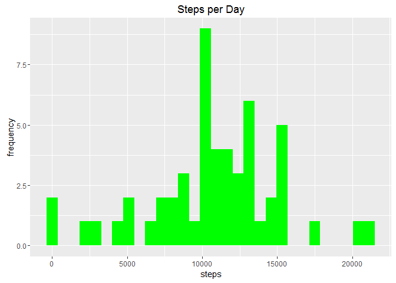
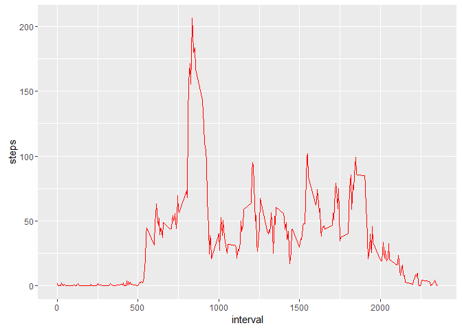
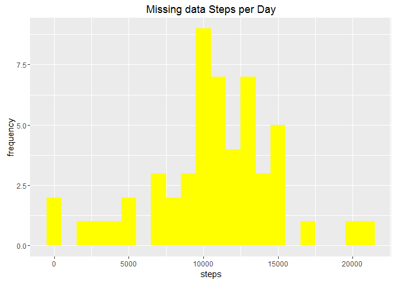
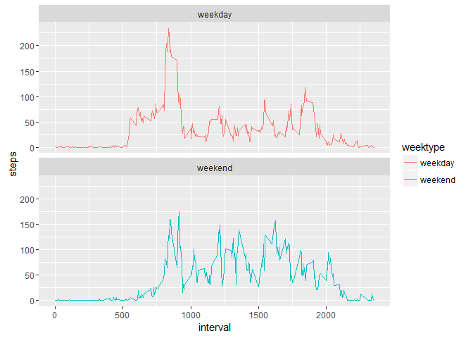

# Reproducible Research: Peer Assessment 1

```r
#install.packages("dplyr")
#install.packages("ggplot2")
#install.packages("lubridate")

#loading the libraries
library(dplyr)
```

```
## Warning: package 'dplyr' was built under R version 3.1.2
```

```
## 
## Attaching package: 'dplyr'
```

```
## The following object is masked from 'package:stats':
## 
##     filter
```

```
## The following objects are masked from 'package:base':
## 
##     intersect, setdiff, setequal, union
```

```r
library(ggplot2)
```

```
## Warning: package 'ggplot2' was built under R version 3.1.3
```

```r
library(lubridate)
```

```
## Warning: package 'lubridate' was built under R version 3.1.2
```

```r
## Loading and preprocessing the data

aData<-read.csv("activity.csv", header = TRUE, colClasses = c("numeric","character","integer"))

#convert date to the dateformat using lubridate

aData$date<-ymd(aData$date)
str(aData)
```

```
## 'data.frame':	17568 obs. of  3 variables:
##  $ steps   : num  NA NA NA NA NA NA NA NA NA NA ...
##  $ date    : POSIXct, format: "2012-10-01" "2012-10-01" ...
##  $ interval: int  0 5 10 15 20 25 30 35 40 45 ...
```

```r
org_Data<-aData
oSteps<- aData %>% filter(!is.na(steps)) %>% group_by(date) %>% summarise(steps=sum(steps))

ggplot(oSteps, aes(x=steps))+geom_histogram(fill="green")+labs(title="Steps per Day",x="steps",y="frequency")
```

```
## `stat_bin()` using `bins = 30`. Pick better value with `binwidth`.
```

<!-- -->

```r
## What is mean total number of steps taken per day?

meanSteps <- mean(oSteps$steps)
meanSteps
```

```
## [1] 10766.19
```

```r
medianSteps <- median(oSteps$steps)
medianSteps
```

```
## [1] 10765
```

```r
## What is the average daily activity pattern?


oInterval<-aData%>%filter(!is.na(steps))%>%group_by(interval)%>%summarise(steps=mean(steps))
ggplot(oInterval, aes(x=interval, y=steps))+geom_line(color="red")
```

<!-- -->

```r
oInterval[which.max(oInterval$steps),]
```

```
## Source: local data frame [1 x 2]
## 
##   interval    steps
## 1      835 206.1698
```

```r
## Imputing missing values

count(aData%>%filter(is.na(steps)))
```

```
## Source: local data frame [1 x 1]
## 
##      n
## 1 2304
```

```r
nas <- is.na(aData$steps)
processedData<-aData


avg_interval<-tapply(aData$steps, aData$interval, mean, na.rm=TRUE, simplify = TRUE)

processedData$steps[nas] <- avg_interval[as.character(processedData$interval[nas])]

sum(is.na(processedData$steps))
```

```
## [1] 0
```

```r
# Missing value data histogram

ggplot(oSteps, aes(x=steps))+geom_histogram(fill="yellow", binwidth = 1000)+labs(title="Missing data Steps per Day",x="steps",y="frequency")
```

<!-- -->

```r
meanSteps <- mean(org_Data$steps, na.rm=TRUE)
meanSteps
```

```
## [1] 37.3826
```

```r
medianSteps <- median(org_Data$steps, na.rm = TRUE)
medianSteps
```

```
## [1] 0
```

```r
## Are there differences in activity patterns between weekdays and weekends?

weektype <-ifelse(weekdays(org_Data$date) == "Saturday" | weekdays(org_Data$date) == "Sunday", "weekend", "weekday")
org_Data<-mutate(org_Data, weektype)
org_Data$weektype<-as.factor(org_Data$weektype)
head(org_Data)
```

```
##   steps       date interval weektype
## 1    NA 2012-10-01        0  weekday
## 2    NA 2012-10-01        5  weekday
## 3    NA 2012-10-01       10  weekday
## 4    NA 2012-10-01       15  weekday
## 5    NA 2012-10-01       20  weekday
## 6    NA 2012-10-01       25  weekday
```

```r
weekday_aData <- org_Data %>%filter(!is.na(steps))%>%group_by(interval, weektype) %>%summarise(steps = mean(steps))
ggplot(weekday_aData, aes(x=interval, y=steps, color=weektype))+geom_line()+facet_wrap(~weektype, ncol=1, nrow=2)
```

<!-- -->
